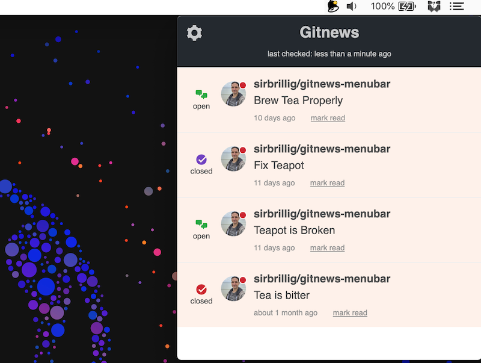

# Gitnews

An app to display GitHub notifications in your menu bar.



## Why not use another app?

There are several other apps that are similar to this one. Notably, you might want to check out:

- [Octobox](https://octobox.io/)
- [DevHub](https://devhubapp.com/)
- [Gitify](https://www.gitify.io/)
- [Trailer](http://ptsochantaris.github.io/trailer/)

I developed Gitnews primarily because it easily allows you to see private notifications, which many of the other apps do not. I think it's also quite a lot simpler, but try it out for yourself and make your own decision.

## ✨ Download ✨

Currently the packaged version of Gitnews is only built for Mac OS but the app should work on any platform. If anyone wants to try running it in Windows or Linux I'd be happy to discuss it; please [create an issue](https://github.com/sirbrillig/gitnews-menubar/issues/new).

💡 **Note:** I don't have a paid Apple developer account, so the package will warn you that the app is from an "Unidentified developer". The first time you open the app you will need to right-click on it and select "Open" from the context menu. [This Apple support doc](https://support.apple.com/kb/ph18657?locale=en_US) explains how to do this in more detail.

👉 Visit [the releases page](https://github.com/sirbrillig/gitnews-menubar/releases) to download an image of the latest release.

When you run Gitnews, you will need to generate an API key from your GitHub account. The app will guide you through creating one.

## Bug reports

💣 If you have any trouble with Gitnews, please [create an issue](https://github.com/sirbrillig/gitnews-menubar/issues/new) to describe what happened.

## Attributions

 Bell icon made by <a href="http://www.flaticon.com/authors/daniel-bruce">Daniel Bruce</a> from <a href="http://www.flaticon.com">Flaticon</a> (<a href="http://creativecommons.org/licenses/by/3.0/">CC 3.0 BY</a>).

## Development

gitnews-menubar is built using [Electron](https://electron.atom.io/), [React](https://facebook.github.io/react/), and [gitnews](https://github.com/sirbrillig/gitnews).

To run the development version from the source, first install all dependencies by running `yarn` (you must have [yarn](https://yarnpkg.com/en/) installed for this to work). Next run the command `npm start`.

If you need to open the developer tools in the production build, you can do so by pressing `CMD-SHIFT-c`.

The app uses [debug](https://github.com/visionmedia/debug), so you can enable all sorts of debug output in the console by typing

```js
localStorage.setItem('debug', 'gitnews-menubar')
```

Rather than use real data, you can use mock data by enabling demo mode. This also disables network side effects (like marking a notification as read). To do this, create a `.env` file in the source directory and include the following:

```
GITNEWS_DEMO_MODE=y
```

### Building a package

To create a packaged Mac OS App, first install dependencies by running `yarn` (you must have [yarn](https://yarnpkg.com/en/) installed for this to work).

Next run the following command: `npm run build`.

You will then find an executable application in the `dist` directory.
