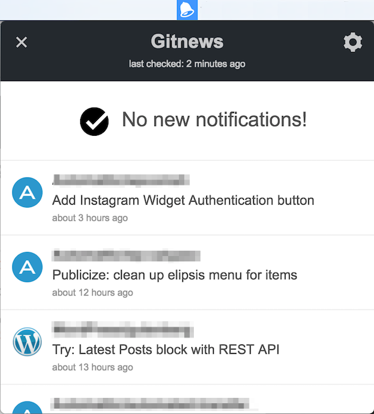

# Gitnews

An app to display GitHub notifications in your menu bar.

## Why not use another app?

This app is much less fully featured than the excellent [Gitify](http://gitify.io/) or [DevSpace](https://devspace.io/). So why use it?

Well, for me, there were two reasons:

1. **Simplicity**: Gitnews does one thing; it tells you if you have any GitHub notifications.
2. **All notifications**: Gitnews will display all your notifications, even for private repositories.

## Attributions

The icons were made by <a href="http://www.flaticon.com/authors/daniel-bruce">Daniel Bruce</a> and <a href="http://www.flaticon.com/authors/gregor-cresnar">Gregor Cresnar</a> from <a href="http://www.flaticon.com">Flaticon</a> (<a href="http://creativecommons.org/licenses/by/3.0/">CC 3.0 BY</a>).
