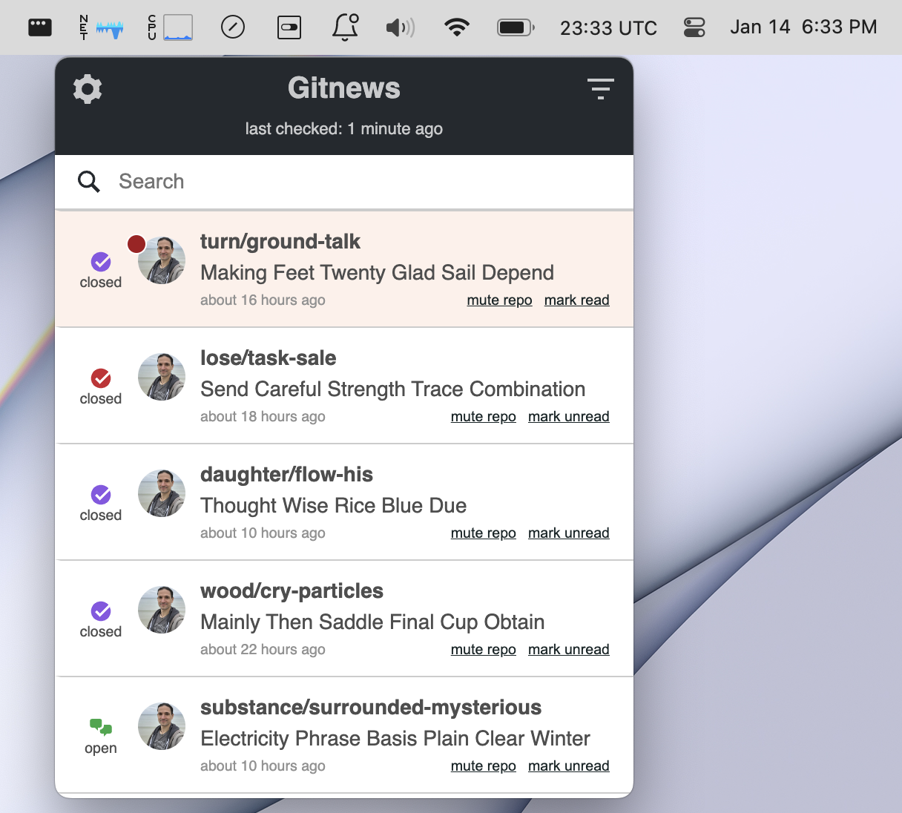

# Gitnews

An app to display GitHub notifications in your menu bar.

## Why not use another app?

This app is much less fully featured than the excellent [Gitify](http://gitify.io/) or [DevSpace](https://devspace.io/). So why use it?

Well, for me, there were two reasons:

1. **Simplicity**: Gitnews does one thing; it tells you if you have any GitHub notifications.
2. **All notifications**: Gitnews will display all your notifications, even for private repositories.

## Attributions

Bell icon made by <a href="http://www.flaticon.com/authors/daniel-bruce">Daniel Bruce</a> from <a href="http://www.flaticon.com">Flaticon</a> (<a href="http://creativecommons.org/licenses/by/3.0/">CC 3.0 BY</a>).

## Development

gitnews-menubar is built using [Electron](https://electron.atom.io/), [React](https://facebook.github.io/react/), and [gitnews](https://github.com/sirbrillig/gitnews).

To run the development version, first install all dependencies by running `yarn` (you must have [yarn](https://yarnpkg.com/en/) installed for this to work).

Next run the command `npm start`.

## Building

To create a packaged Mac OS App, first install dependencies by running `yarn` (you must have [yarn](https://yarnpkg.com/en/) installed for this to work).

Next run the following command: `npm run package`.

You will then find an executable application in the `release-builds` directory.
